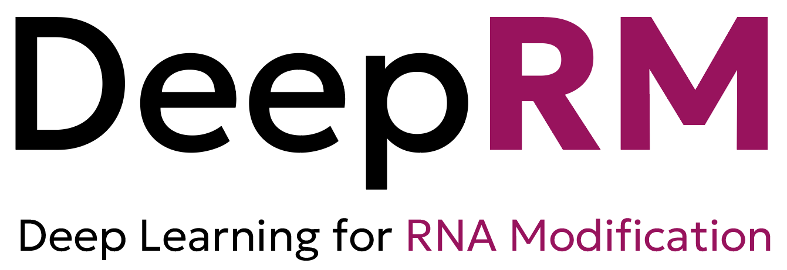
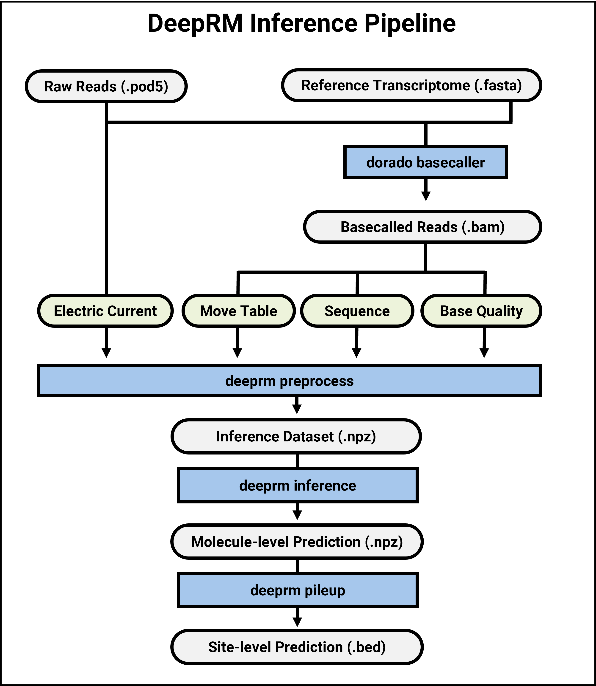
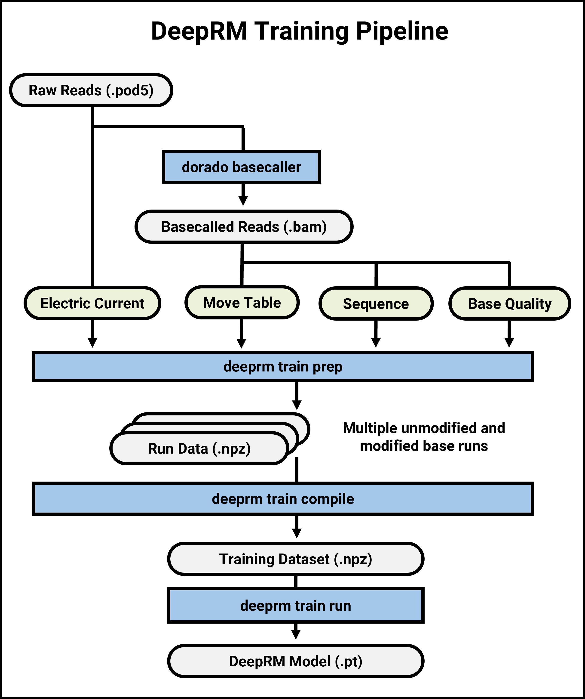

# DeepRM
#### Deep learning for RNA Modification




## Table of Contents
* [✨ Introduction](#-introduction)
* [🎯 Key Features](#-key-features)
* [📦 Installation](#-installation)
* [🚀 Quickstart](#-quickstart)
* [💻 Usage](#-usage)
  * [Inference](#inference-usage)
  * [Training](#training-usage)
* [📐 Architecture](#-architecture)
* [📝 Citation](#-citation)
* [📝 License](#-license)
* [🏛️ Contributors](#-contributors)
* [🏛️ Acknowledgements](#-acknowledgements)


## ✨ Introduction
DeepRM is a deep learning-based framework for RNA modification detection using Nanopore direct RNA sequencing.
This repository contains the source code for training and running DeepRM.

## 🎯 Key Features
* **High accuracy**: Achieves state-of-the-art accuracy in RNA modification detection and stoichiometry measurement.
* **Single-molecule resolution**: Provides single-molecule level predictions for RNA modifications.
* **End-to-end pipeline**: Easy-to-use pipeline from raw reads to site-level predictions.
* **Customizable**: Supports training of custom models.

## 📦 Installation

### Prerequisites
* Linux x86_64
* Python 3.9+
* Pytorch 2.0+
  * https://pytorch.org/get-started/locally/
  * Please ensure that you have installed the correct version of PyTorch with CUDA support if you want to use GPU for inference or training.

#### Optional
* Torchmetrics 0.9.0+ (only for training)
  * ```bash
    python -m pip install torchmetrics
    ```
* Dorado 0.7.3+ (optional, for basecalling)
  * https://github.com/nanoporetech/dorado
* SAMtools 1.16.1+ (optional, for BAM file processing)
  * http://www.htslib.org/

* Python package requirements are listed in `requirements.txt` and will be installed automatically when you install DeepRM.

### Installation options
1. Install via PIP (recommended)

```bash
python -m pip install deeprm
```

2. Install via Conda

```bash
conda install -c conda-forge deeprm
```

3. Install from source (GitHub)

```bash
git clone https://github.com/vadanamu/deeprm
cd deeprm
python -m pip install -U pip
python -m pip install -e .
```
 * If installation fails on old OS (e.g., CentOS 7) due to NumPy, you can try installing older versions of NumPy first:
 * ```bash
    python -m pip install "numpy<2.3.0,>2.0.0"
    python -m pip install -e .
    ```

### Verify Installation

```bash
deeprm --version
deeprm check
```
 * If everything is installed correctly, you should see the version of DeepRM and a message indicating that the installation is successful.
 * If you encounter CUDA or torch-related errors, make sure you have installed the correct version of PyTorch with CUDA support.

### Build from Source
* DeepRM can use a C++-based preprocessing tool for acceleration, which is both provided as a precompiled binary and source code.
* Depending on your system configuration, you may need to build the C++ preprocessing tool from source, located in the `cpp` directory of the DeepRM repository.
* Please refer to the [cpp/README.md](cpp/README.md) page for detailed build instructions.

## 🚀 Quickstart
* For demonstration purposes, you can use examples POD5 and BAM files provided in the `examples` directory of the repository.
* You can also use your own POD5 and BAM files.

### RNA Modification Detection
1️⃣ **Prepare data**
```bash
deeprm call prep -p inference_example.pod5 -b inference_example.bam -o <prep_dir>
```
* (Alternative) To supply your own POD5 file:
  ```bash
  dorado basecaller --reference <ref_fasta> --min-qscore 0 --emit-moves rna004_130bps_sup@v5.0.0 <pod5_dir> | \
  tee >(deeprm call prep -p <pod5_dir> -b - -o <prep_dir>) >(<bam_path>)
  ```
2️⃣ **Run inference**
```bash
deeprm call run -b inference_example.bam -i <prep_dir> -o <pred_dir>
```

### Model Training
1️⃣ **Prepare unmodified & modified training data**
```bash
deeprm train prep -p training_a_example.pod5 -b training_a_example.bam -o <prep_dir>/a
deeprm train prep -p training_m6a_example.pod5 -b training_m6a_example.bam -o <prep_dir>/m6a
```
2️⃣ **Compile training data**
```bash
deeprm train compile -n <prep_dir>/a/data -p <prep_dir>/m6a/data -o <prep_dir>/compiled
```
3️⃣ **Run training**
```bash
deeprm train run -d <prep_dir>/compiled -o <output_dir>
```


## 💻 Usage
### Inference usage


#### Prepare Data
##### Accelerated preparation (recommended, default)
```bash
dorado basecaller --reference <ref_fasta> --min-qscore 0 --emit-moves rna004_130bps_sup@v5.0.0 <pod5_dir> | \
tee >(deeprm call prep -p <pod5_dir> -b - -o <prep_dir>) >(<bam_path>)
```

##### Sequential preparation
* This method is slower than the accelerated preparation method, but is supported for cases such as:
    * The POD5 files are already basecalled to BAM files with move tags.
    * You want to run basecalling and preprocessing in separate machines.

* Basecall the POD5 files to BAM files with move tags (skip if already done):
```bash
dorado basecaller --reference <reference_path> --min-qscore 0 --emit-moves rna004_130bps_sup@v5.0.0 <pod5_dir> > <raw_bam_path>"
```
* Filter, sort, and index the BAM files:
```bash
samtools view -@ <threads> -bh -F 276 -o <bam_path> <raw_bam_path>
samtools sort -@ <threads> -o <bam_path> <bam_path>
samtools index -@ <threads> <bam_path>
```
* To preprocess the inference data (transcriptome), run the following command:
```bash
deeprm call prep --input <input_POD5_dir> --output <output_file> --dorado <dorado_dir>
```
* This will create the npz files for inference.

#### Run Inference
* The trained DeepRM model file is attached in the repository: `model/deeprm_model.pt`.
* For inference, run the following command:
    * Modify the '-bs' (batch size) parameter according to your GPU memory capacity (default: 1000).
```bash
deeprm call run --model <model_file> --data <data_dir> --output <prediction_dir> --gpu_pool <gpu_pool>
```
* This will create a directory with the result files.

### Training usage

#### Prepare Data
* You can skip this step if your POD5 files are already basecalled to BAM files with move tags.
```bash
dorado basecaller --min-qscore 0 --emit-moves rna004_130bps_sup@v5.0.0 <pod5_dir> > <bam_path>
samtools index -@ <threads> <bam_path>
```
* To preprocess the training data (synthetic oligonucleotide), run the following command:
```bash
deeprm train prep --input <input_POD5_dir> --output <output_file>
```
* This will create:
    * Training dataset: /block
* To compile the training dataset, run the following command:
```bash
deeprm train compile --input <input_POD5_dir> --output <output_file>
```
* This will create:
    * Training dataset: /block
#### Run Training
* To train the model, run the following command:
```bash
deeprm train run --model deeprm_model --data <data_dir> --output <output_dir> --gpu_pool <gpu_pool>
```
* This will create a directory with the trained model file.


## 📐 Architecture


## 🏛️ Contributors
This repository is developed and maintained by the following organization:
* **Laboratory of Computational Biology, School of Biological Sciences, Seoul National University**
    * Principal Investigator: Prof. Daehyun Baek
* **Genome4me, Inc., Seoul, Republic of Korea**


This repository is maintained by the following authors:
* Hyeonseo Hwang


## 🏛️ Acknowledgements
This study was supported by the National Research Foundation of Korea (NRF) funded by the Ministry of Science and ICT, Republic of Korea (MSIT) (RS-2019-NR037866, RS-2020-NR049252, RS-2020-NR049538, and RS-2022-NR067483), by a grant of Korean ARPA-H Project through the Korea Health Industry Development Institute (KHIDI), funded by the Ministry of Health & Welfare, Republic of Korea (RS-2025-25422732), by Artificial Intelligence Industrial Convergence Cluster Development Project funded by MSIT and Gwangju Metropolitan City, by National IT Industry Promotion Agency (NIPA) funded by MSIT, and by Korea Research Environment Open Network (KREONET) managed and operated by Korea Institute of Science and Technology Information (KISTI).
