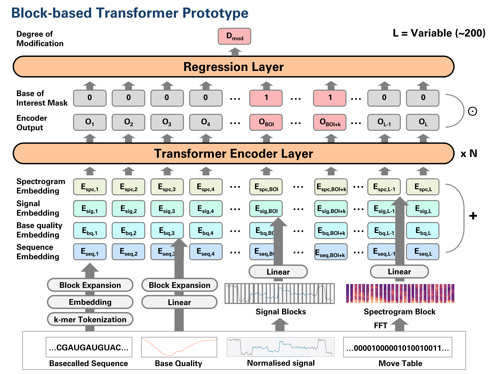

# AIRNA

## Introduction
AIRNA is a transformer-based model for RNA modification detection using Nanopore direct RNA sequencing.
This repository contains the source code for training and evaluating BERMUDA.

## License
See the [LICENSE](LICENSE) file for details.

## Authors
* **Hyeonseo Hwang** - Laboratory of Computational Biology, Seoul National University

## Pipeline

## Architecture

## Requirements
* Python 3.8+
* PyTorch 2.0+
* Dorado 0.7.0+
* Scipy
* Pandas
* Polyleven
* Networkx