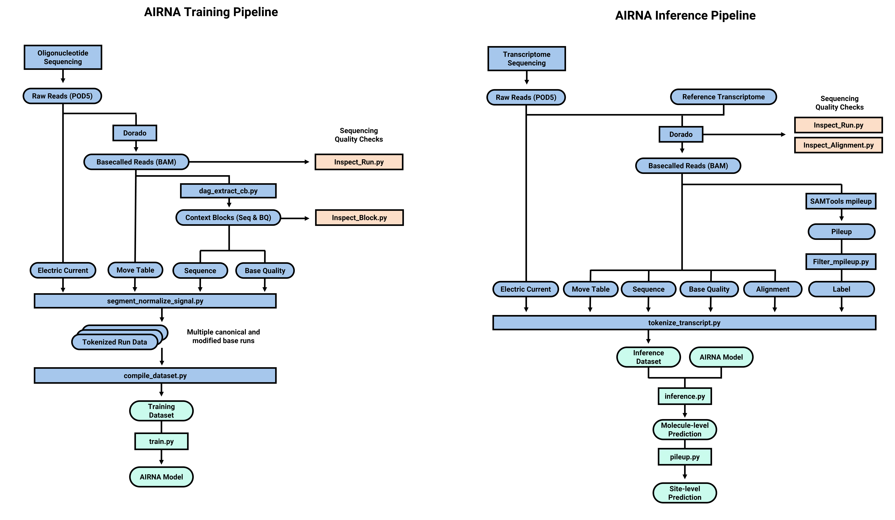

# AIRNA
#### Artificial Intelligence for RNA Modification

## Table of Contents
* [Introduction](#introduction)
* [Usage](#usage)
  * [Preprocessing](#preprocessing)
  * [Training](#training)
  * [Inference](#inference)
* [Requirements](#requirements)
* [Installation](#installation)
* [Design](#design)
  * [Pipeline](#pipeline)
  * [Architecture](#architecture)
* [Contributors](#contributors)
* [License](#license)
* [Citation](#citation)
* [Acknowledgements](#acknowledgements)

## Introduction
AIRNA is a transformer-based model for RNA modification detection using Nanopore direct RNA sequencing.
This repository contains the source code for training and running AIRNA.

## Usage
### Preprocessing
#### Training Data
* To preprocess the training data (synthetic oligonucleotide) from the DRS sequencing result (POD5), run the following command:
```bash
python -m preprocess.master_pipeline --input <input_dir> --output <output_file>
```
* This will create:
  * Files for training: /block/*.npz
  * Filtered mpileup file: /dorado_output.pileup.filtered.pkl
  * Quality check results: /qc/*.png

#### Inference Data
* To preprocess the inference data (transcriptome) from the DRS sequencing result (POD5), run the following command:
```bash
python -m inference.master_pipeline --input <input_dir> --output <output_path> --ref <reference_file> --dorado <dorado_dir>
```
* This will create:
  * Files for inference: /block/*.npz
  * Filtered mpileup file: /dorado_output.pileup.filtered.pkl
  * Quality check results: /qc/*.png

### Training
 * To train the model, run the following command:
```bash
python -m train.train --model airna --data <data_dir> --output <output_dir> --gpu_pool <gpu_pool>
```
* This will create a directory with the trained model file.

### Inference
* For inference, run the following command:
```bash
python -m inference.inference --model <model_file> --data <data_dir> --output <prediction_dir> --gpu_pool <gpu_pool> 
```
* This will create a directory with single-molecule level result files.
* To get a site-level result, run the following command:
```bash
python -m inference.pileup --input <prediction_dir> --output <pileup_dir> --mpileup <mpileup_file>
```
* This will create a directory with site-level result files.

## Requirements
* Python 3.8+
* Dorado 0.7.3+ (https://github.com/nanoporetech/dorado)
* SAMtools 1.16.1+ (http://www.htslib.org/)


* Package requirements are listed in `requirements.txt`
* To install the required packages, run the following command:
```bash
pip install -r requirements.txt
```
* Dorado and SAMtools should be installed separately from the links above.

## Design
### Pipeline


### Architecture


## Installation
Clone the repository:
```bash
git clone https://github.com/vadanamu/AIRNA.git
cd AIRNA
```
PIP and Conda support will be added later.

## Contributors
This repository is maintained by the following authors:
* **Hyeonseo Hwang** - Laboratory of Computational Biology, Seoul National University

## License
See the [LICENSE](LICENSE) file for details.

## Citation
If you use AIRNA in your research, please cite the following paper:
```bibtex
@article{
  title={},
  author={},
  journal={},
  year={},
  publisher={}
}
```

## Acknowledgements
This work was supported by the National Research Foundation of Korea (NRF) funded by the Ministry of Science and ICT, Republic of Korea (MSIT) (NRF-2019M3E5D3073104, NRF-2020R1A2C3007032, NRF-2020R1A5A1018081, and NRF-2022M3A9I2082294), by Artificial Intelligence Industrial Convergence Cluster Development Project funded by MSIT and Gwangju Metropolitan City, by National IT Industry Promotion Agency (NIPA) funded by MSIT, and by Korea Research Environment Open Network (KREONET) managed and operated by Korea Institute of Science and Technology Information (KISTI).
