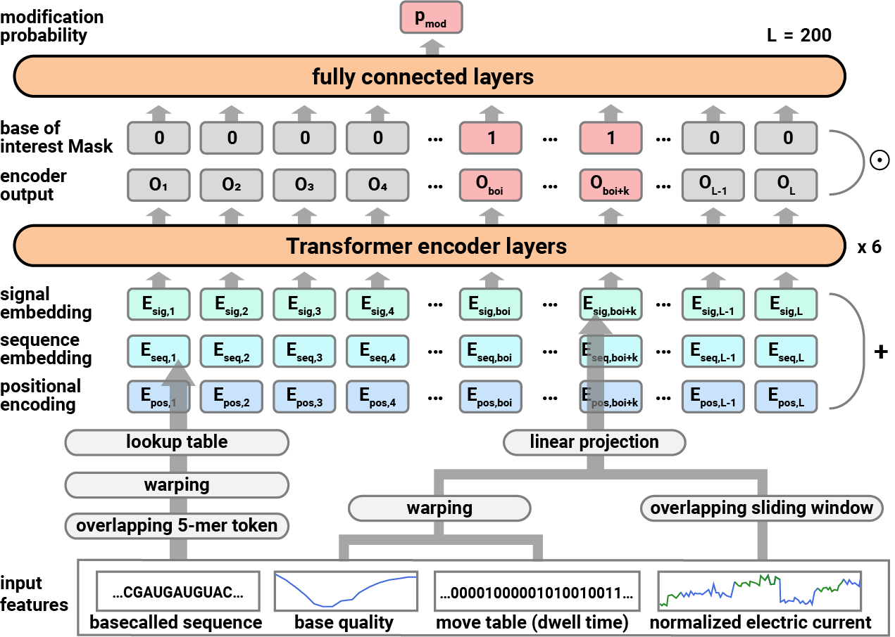

# DeepRM
Deep learning for RNA Modification

```{toctree}
:maxdepth: 1
installation
quickstart
usage
cli/index
api/index
license

```

## ✨ Introduction
DeepRM is a deep learning-based framework for RNA modification detection using Nanopore direct RNA sequencing.
This repository contains the source code for training and running DeepRM.

## 🎯 Key Features
* **High accuracy**: Achieves state-of-the-art accuracy in RNA modification detection and stoichiometry measurement.
* **Single-molecule resolution**: Provides single-molecule level predictions for RNA modifications.
* **End-to-end pipeline**: Easy-to-use pipeline from raw reads to site-level predictions.
* **Customizable**: Supports training of custom models.


## 📝 Citation
If you use DeepRM in your research, please cite the following paper:
```{code-block} text
:class: nohighlight
@article{
  title={Comprehensive discovery of RNA modification sites in the human transcriptome},
  author={Gihyeon Kang, Hyeonseo Hwang, Hyeonseong Jeon, Heejin Choi, Hee Ryung Chang, Junehee Park, Narae Son, Eunkyeong Jeon, Jungmin Lim, Jaeung Yun, Nagyeong Yeo, Yoon Ki Kim, Daehyun Baek},
  journal={In review},
  year={In review},
  publisher={In review}
}
```

## 📐 Architecture


## 🏛️ Contributors
This repository is developed by the following organization:
* **Laboratory of Computational Biology, School of Biological Sciences, Seoul National University**
    * Principal Investigator: Prof. Daehyun Baek

This repository is maintained by the following authors:
* **Hyeonseo Hwang**


## 🏛️ Acknowledgements
This work was supported by the National Research Foundation of Korea (NRF) funded by the Ministry of Science and ICT, Republic of Korea (MSIT) (NRF-2019M3E5D3073104, NRF-2020R1A2C3007032, NRF-2020R1A5A1018081, and NRF-2022M3A9I2082294), by Artificial Intelligence Industrial Convergence Cluster Development Project funded by MSIT and Gwangju Metropolitan City, by National IT Industry Promotion Agency (NIPA) funded by MSIT, and by Korea Research Environment Open Network (KREONET) managed and operated by Korea Institute of Science and Technology Information (KISTI).
